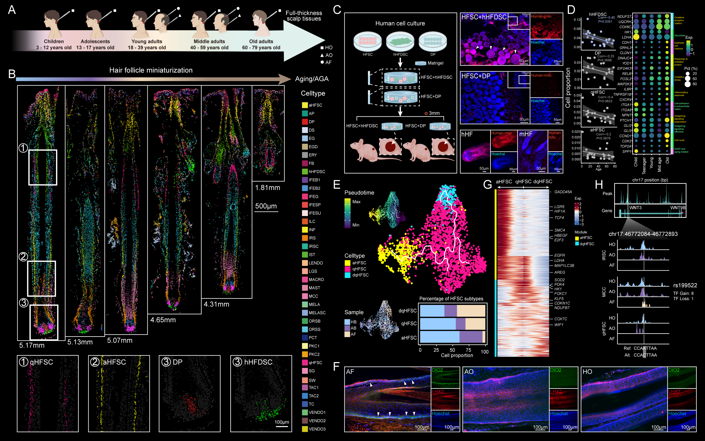

# HHAAMSTAR: Human Hair-follicle Aging and Androgenetic-alopecia Multimodal Spatiotemporal Transcriptomics Atlas

This repository contains scripts used in the analysis of the manuscript: "**Multimodal spatiotemporal atlas of human hair follicle in aging and androgenetic alopecia**".

## Accessions
CNSA-Project: [CNP0006019](https://db.cngb.org/cnsa/)

Processed data can be explored and downloaded in our database [HHAAMSTAR](https://db.cngb.org/stomics/hhaamstar/)

Github: [HHAAMSTAR](https://github.com/BGI-DEV-REG/HHAAMSTAR)

## Citation Information
If you use content from this database in your research or project, please cite the following article:

(Article Link)

## Cell segmentation workflow
We followed the method of cell segmentation described by [Wei et al.](https://www.science.org/doi/10.1126/science.abp9444)

The tools used in this study can be explored at https://github.com/BGI-DEV-REG/ARTISTA/tree/main/code/RYtools/Tools 

## Contact
weixiaoyu@genomics.cn; dujiaxin@genomics.cn; liruikang@genomics.cn
